# LokaRent — System Blueprint

> The definitive document every developer reads before writing a single line of production code.
> Grounded in the existing UI, 55-table Phase 1 schema, and all prior architecture reviews.
> No Prisma models. No SQL. Pure business and architectural reasoning.

---

## Table of Contents

1. [High-Level System Architecture](#1-high-level-system-architecture)
2. [User Journeys](#2-user-journeys)
3. [Complete Business Workflows](#3-complete-business-workflows)
4. [Module Map](#4-module-map)
5. [Dashboard Architecture](#5-dashboard-architecture)
6. [Permission Matrix](#6-permission-matrix)
7. [Lifecycle Diagrams](#7-lifecycle-diagrams)
8. [Business Rules](#8-business-rules)
9. [Automation Flows](#9-automation-flows)
10. [Background Jobs](#10-background-jobs)
11. [Future Extension Points](#11-future-extension-points)
12. [Folder Architecture](#12-folder-architecture)
13. [Development Roadmap](#13-development-roadmap)
14. [Cross-Module Interactions](#14-cross-module-interactions)
15. [Edge Cases and Failure Scenarios](#15-edge-cases-and-failure-scenarios)

---

## 1. High-Level System Architecture

### System Overview

LokaRent is a multi-tenant B2B SaaS platform for car rental agencies. A single deployment serves many independent companies. Each company owns one or more agencies (branches). All business data is scoped at the agency level. The platform has no marketplace — it is a private management tool for each company.

### Tenant Hierarchy

```
Platform (LokaRent)
└── Company  (e.g. "AutoMaroc SARL")
      ├── Subscription  (plan + limits + feature flags)
      ├── Agency A  (e.g. "Casablanca Centre")
      │     ├── Members (users with roles)
      │     ├── Fleet (vehicles)
      │     ├── Customers
      │     ├── Reservations → Contracts → Invoices
      │     └── Expenses
      └── Agency B  (e.g. "Marrakech Airport")
            └── (same structure)
```

**Key constraint:** A user belongs to one company. Within that company, they can be a member of one or more agencies. Their permissions differ per agency based on their agency-level role.

**Workspace is not a database concept.** It is the UI section where company-level settings (members, agencies, billing, permissions) are managed. It has no corresponding table.

### Architecture Diagram

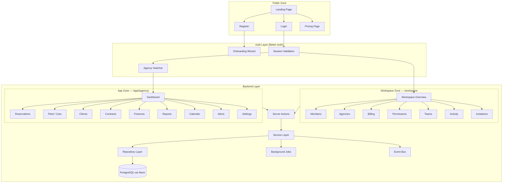

### Technology Stack

| Layer | Technology | Reason |
|-------|------------|--------|
| Framework | Next.js 16 App Router | SSR, Server Actions, file-based routing |
| Database | PostgreSQL via Neon | Serverless, scales to zero, Drizzle ORM |
| Auth | Better Auth | Session management, role-aware middleware |
| ORM | Drizzle ORM | Type-safe, lightweight, no magic |
| UI | shadcn/ui + Tailwind v4 | Consistent design system |
| State | React Context + SWR | Agency-scoped client state |
| Animation | motion/react | Smooth UI transitions |
| Charts | Recharts via shadcn/ui | KPI and reporting charts |
| File Storage | Vercel Blob | Documents and vehicle photos |
| Background Jobs | Vercel Cron | Scheduled tasks |
| Email | Resend (Phase 2) | Transactional emails |
| PDF | React PDF (Phase 2) | Contract and invoice generation |

---

## 2. User Journeys

### Journey 1 — Visitor

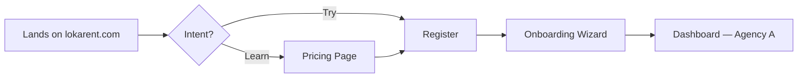

The visitor sees a landing page, pricing table, and a register CTA. Registration always creates a company + one default agency + the owner account in a single database transaction. There is no freemium usage before registration — the trial starts after account creation.

### Journey 2 — Company Owner (post-registration)

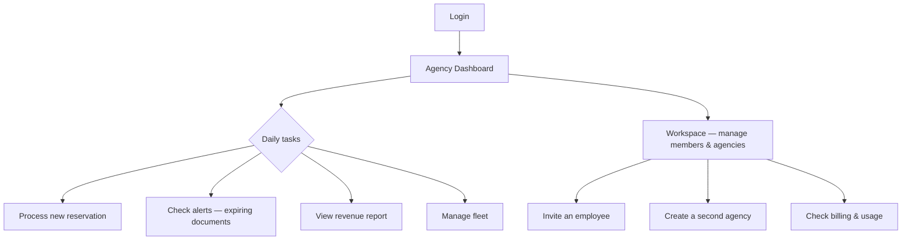

The owner is the only role with access to both the Workspace (company-level) and all agency dashboards. They can switch between agencies using the agency switcher in the sidebar header.

### Journey 3 — Agency Admin

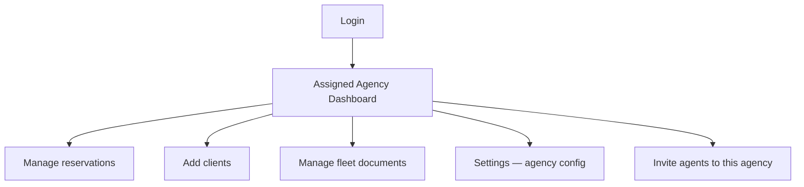

The admin manages day-to-day operations of their assigned agency. They cannot access other agencies or Workspace billing. They can manage agency settings, users within their agency, and all operational modules.

### Journey 4 — Agent / Employee

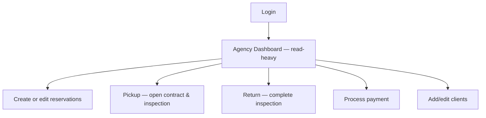

The agent handles the operational workflow: reservation creation, client intake, vehicle pickup (contract + inspection), return processing, and payment recording. They cannot access financial reports, delete entities, or modify agency settings.

### Journey 5 — Accountant

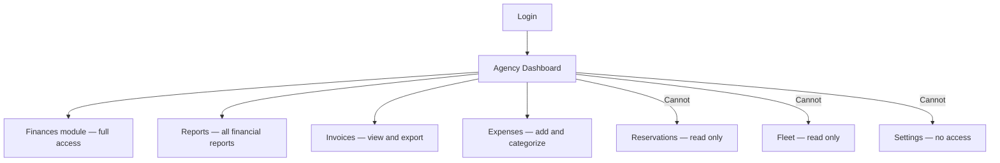

The accountant sees financial data across the agency but cannot modify operational records. They can export invoices, add expenses, and view all financial reports.

### Journey 6 — Read-Only

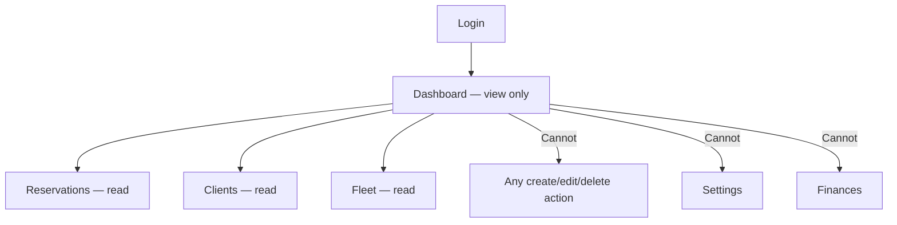

### Journey 7 — New Reservation (detailed agent flow)

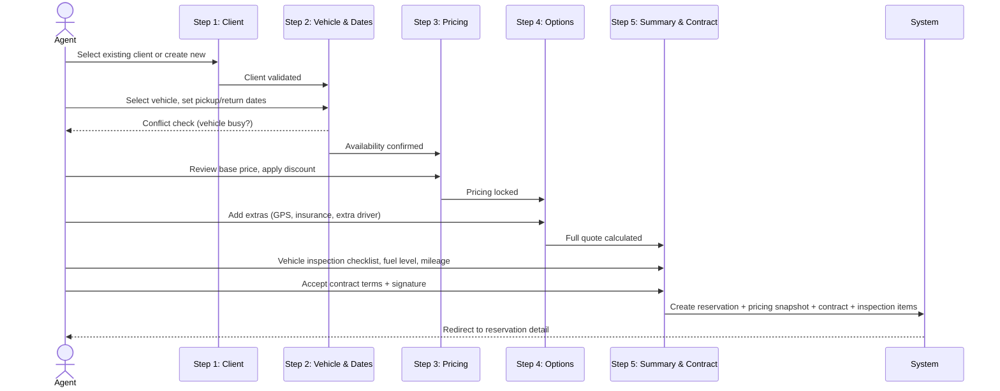

---

## 3. Complete Business Workflows

### Workflow 1 — Company Registration & Onboarding

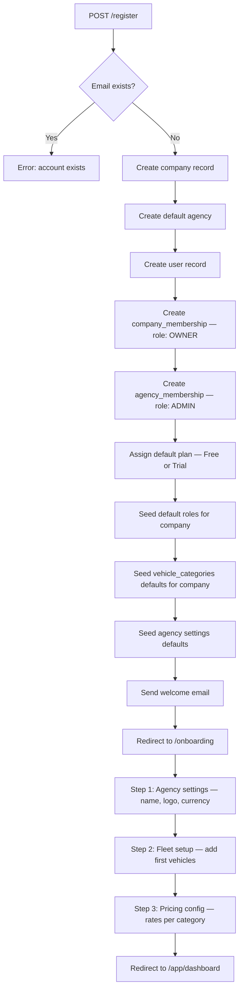

**Gap identified:** The onboarding wizard must complete atomically. If the user abandons halfway, the company record already exists. The system must handle re-entry into `/onboarding` for companies with `status = 'onboarding'` and resume from the last completed step.

**Business rule:** A company in `status = 'onboarding'` cannot invite members or add more agencies until onboarding is marked `status = 'active'`.

---

### Workflow 2 — Full Reservation Lifecycle

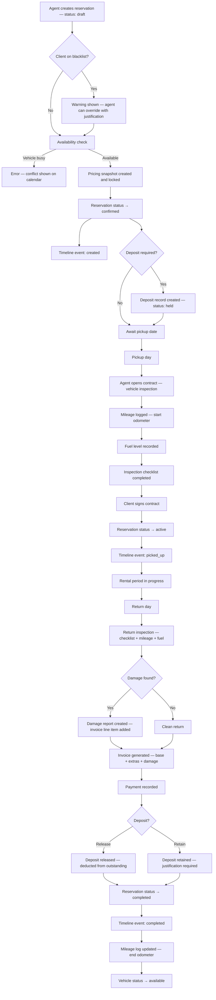

**Business rules enforced at each transition:**
- `draft → confirmed`: requires client, vehicle, valid dates, pricing snapshot
- `confirmed → active`: requires completed inspection checklist and client signature
- `active → completed`: requires return inspection and at least one payment record
- Any status → `cancelled`: requires cancellation reason; if deposit was collected, it triggers a manual review

---

### Workflow 3 — Vehicle Pickup (Contract Creation)

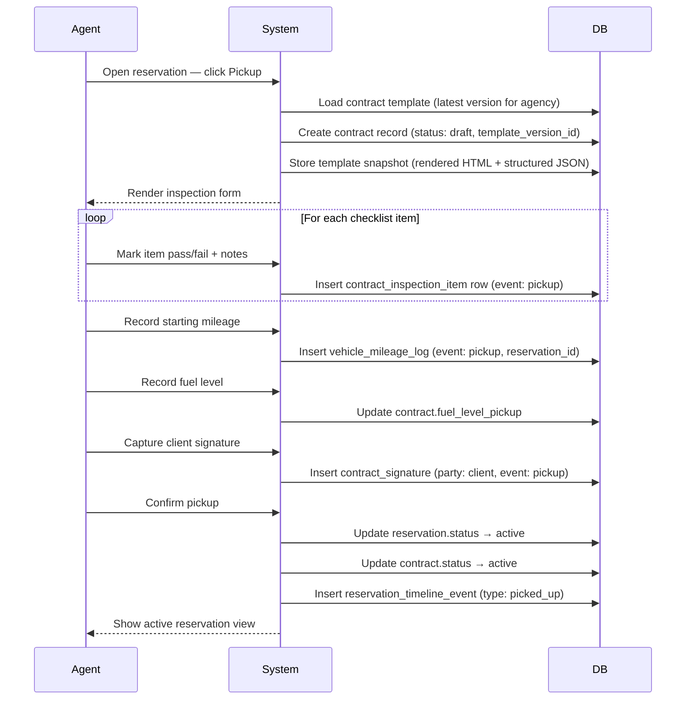

---

### Workflow 4 — Invoice Generation

Invoice generation is triggered automatically when a reservation transitions to `completed`. It is never manually created from scratch.

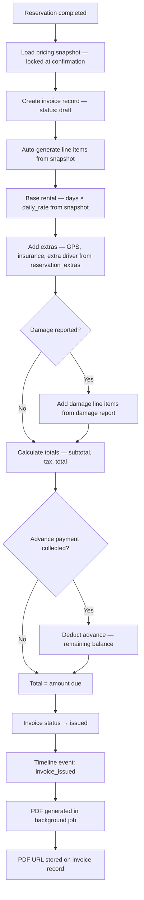

**Critical rule:** Invoice line items are generated from the **pricing snapshot**, not from the current pricing settings. The pricing settings can change after booking. The snapshot is immutable from the moment of reservation confirmation. This is a correctness requirement, not an optimisation.

---

### Workflow 5 — Agency Member Invitation

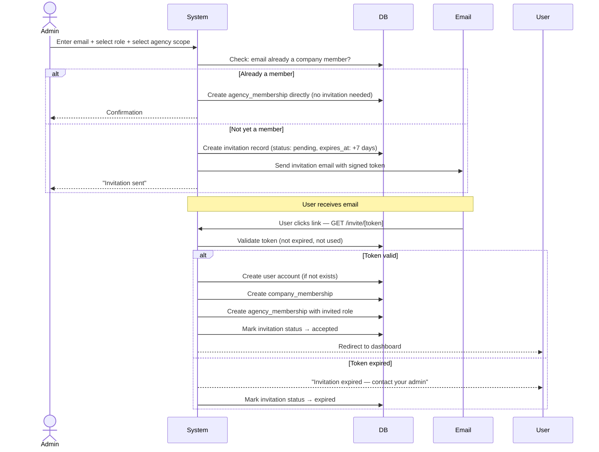

**Edge case:** If the invited email already has a LokaRent account at a different company, the invitation is rejected. Users belong to one company. This is a hard business constraint.

---

### Workflow 6 — Payment Recording

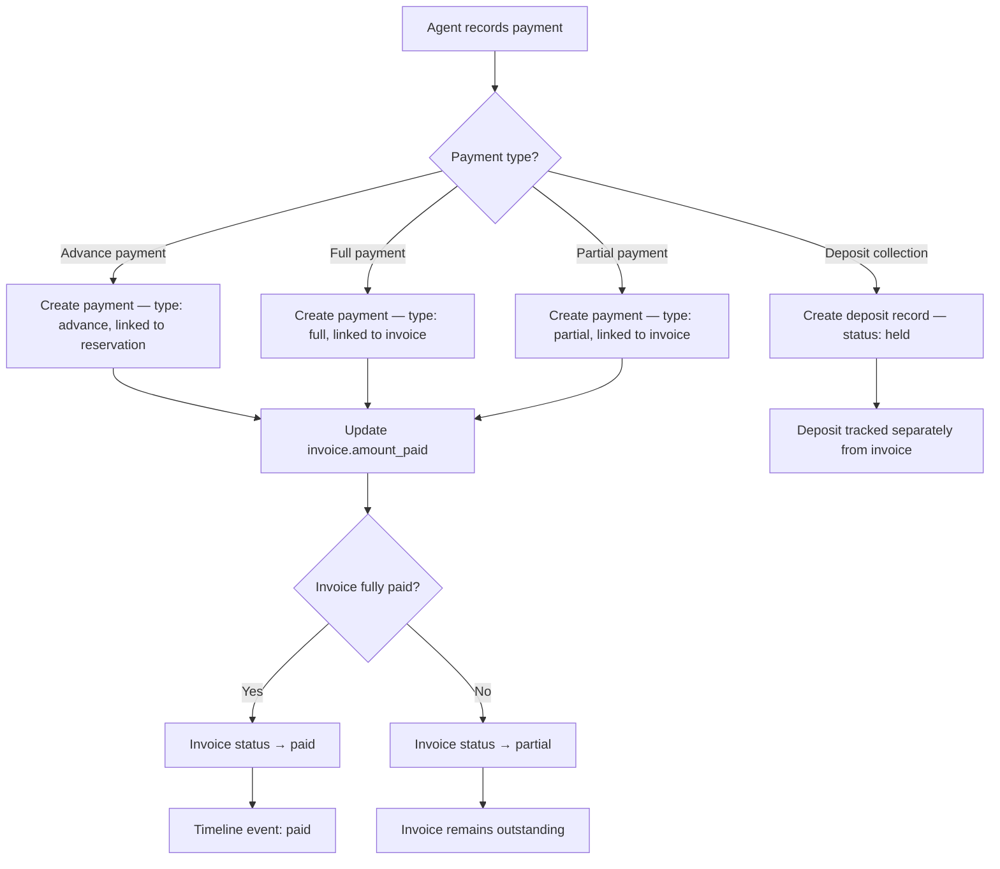

**Business rule:** A deposit is never treated as a payment toward the invoice total. It is a separate liability that is either released (returned to client) or retained (transferred to revenue). A retained deposit generates an additional credit note or expense entry depending on reason.

---

## 4. Module Map

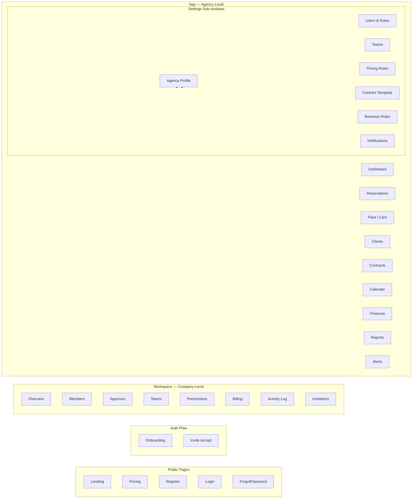

### Module Dependencies

| Module | Reads from | Writes to | Triggers |
|--------|-----------|-----------|---------|
| Reservations | Fleet, Clients | Reservations, Pricing Snapshot, Timeline | Contract creation, Invoice generation |
| Contracts | Reservations, Fleet, Clients | Contracts, Inspections, Signatures, Mileage | Reservation status change |
| Finances | Reservations, Contracts | Payments, Invoices, Deposits, Expenses | Invoice status updates |
| Fleet | — | Vehicles, Vehicle history tables | Alerts (when docs expire) |
| Clients | — | Customers, Blacklist | Reservation validation |
| Alerts | Fleet, Reservations, Contracts | — (read-only aggregate) | None — reactive display |
| Calendar | Reservations, Fleet | Availability Blocks | None |
| Reports | All modules | — (read-only aggregate) | None |
| Dashboard | All modules | — (read-only aggregate) | None |

---

## 5. Dashboard Architecture

### KPI Computation Strategy

Dashboard KPIs are **not** computed in real-time from raw tables on every page load. For Phase 1 this is acceptable (volume is low), but the architecture must be designed to allow caching later without restructuring.

**Phase 1 approach:** Server-side aggregation on each request, executed in a single batched query set per agency. No client-side computation.

**Phase 3 approach:** Daily snapshot job writes pre-aggregated KPIs to a `dashboard_snapshots` table. Dashboard reads from the snapshot, refreshed on mutation events.

### KPI Catalog

| KPI | Source | Formula |
|-----|--------|---------|
| Active rentals | reservations | `COUNT WHERE status = 'active' AND agency_id = ?` |
| Occupancy rate | reservations + vehicles | `active_days / (fleet_size × period_days) × 100` |
| Revenue (period) | payments | `SUM amount WHERE type IN (full, partial) AND date IN period` |
| Pending payments | invoices | `SUM (total - amount_paid) WHERE status != 'paid'` |
| Fleet utilization | vehicles + reservations | Per-vehicle occupancy last 30 days |
| Upcoming returns | reservations | `WHERE status = 'active' AND end_date <= now() + 48h` |
| Overdue reservations | reservations | `WHERE status = 'active' AND end_date < now()` |
| Expiring documents | vehicle_insurances, vehicle_registrations, vehicle_inspections | `WHERE expires_at <= now() + 30 days` |
| Top clients | reservations | `GROUP BY customer_id ORDER BY COUNT DESC LIMIT 5` |
| Top vehicles | reservations | `GROUP BY vehicle_id ORDER BY revenue DESC LIMIT 5` |

### Dashboard Layout

```
┌─────────────────────────────────────────────────────┐
│ KPI Grid (8 cards)                                  │
│ Active | Returns | Revenue | Overdue | Alerts | ... │
├─────────────────────────┬───────────────────────────┤
│ Revenue Chart (line)    │ Fleet Status (donut)       │
│ Last 6 months           │ Available / Active / Maint │
├─────────────────────────┼───────────────────────────┤
│ Active Rentals (list)   │ Upcoming Returns (list)    │
├─────────────────────────┼───────────────────────────┤
│ Alerts Banner           │ Top Cars / Top Clients     │
└─────────────────────────┴───────────────────────────┘
```

Each widget is an independent server component that can be independently cached in Phase 3.

---

## 6. Permission Matrix

### Role Definitions

| Role | Scope | Who |
|------|-------|-----|
| `OWNER` | Company | The person who registered. One per company. |
| `ADMIN` | Agency | Manages an agency branch — can do everything except billing |
| `ACCOUNTANT` | Agency | Financial read/write, operational read-only |
| `AGENT` | Agency | Full operational access, no financial settings |
| `READONLY` | Agency | View-only across all modules |

### Permission Matrix

| Action | OWNER | ADMIN | ACCOUNTANT | AGENT | READONLY |
|--------|-------|-------|------------|-------|----------|
| **Workspace** |
| View workspace | Y | N | N | N | N |
| Manage members | Y | N | N | N | N |
| Create agencies | Y | N | N | N | N |
| Manage billing | Y | N | N | N | N |
| View activity log | Y | N | N | N | N |
| **Agency — Reservations** |
| View reservations | Y | Y | Y (read) | Y | Y |
| Create reservation | Y | Y | N | Y | N |
| Edit reservation | Y | Y | N | Y (own) | N |
| Cancel reservation | Y | Y | N | Y (own, pending only) | N |
| Delete reservation | Y | Y | N | N | N |
| **Agency — Fleet** |
| View vehicles | Y | Y | Y | Y | Y |
| Add vehicle | Y | Y | N | N | N |
| Edit vehicle | Y | Y | N | N | N |
| Delete vehicle | Y | Y | N | N | N |
| Add maintenance record | Y | Y | N | Y | N |
| **Agency — Clients** |
| View clients | Y | Y | Y | Y | Y |
| Create client | Y | Y | N | Y | N |
| Edit client | Y | Y | N | Y | N |
| Delete client | Y | Y | N | N | N |
| Blacklist client | Y | Y | N | N | N |
| **Agency — Contracts** |
| View contracts | Y | Y | Y | Y | Y |
| Create/sign contract | Y | Y | N | Y | N |
| Export contract PDF | Y | Y | Y | Y | N |
| **Agency — Finances** |
| View invoices | Y | Y | Y | N | N |
| Record payment | Y | Y | Y | N | N |
| Manage deposits | Y | Y | Y | N | N |
| View expenses | Y | Y | Y | N | N |
| Add expense | Y | Y | Y | N | N |
| View financial reports | Y | Y | Y | N | N |
| Export reports | Y | Y | Y | N | N |
| **Agency — Settings** |
| Agency profile | Y | Y | N | N | N |
| Pricing rules | Y | Y | N | N | N |
| Contract template | Y | Y | N | N | N |
| Invite users | Y | Y | N | N | N |
| Manage roles | Y | Y | N | N | N |
| **Reports** |
| View reports | Y | Y | Y | N | N |
| Export reports | Y | Y | Y | N | N |

### Permission Implementation

Permissions are checked in this order:
1. Is the user's session valid and not expired?
2. Does the user have an `agency_membership` for the requested `agency_id`?
3. What is their role in that membership?
4. Does that role include the required `permission_key`?
5. Is there a `user_permission_override` that grants or denies the specific key? (Overrides win.)

Server Actions must perform this check before executing any mutation. A dedicated `can(userId, agencyId, permissionKey)` helper in `shared/permissions/` is the single implementation point.

---

## 7. Lifecycle Diagrams

### 7.1 Vehicle Lifecycle

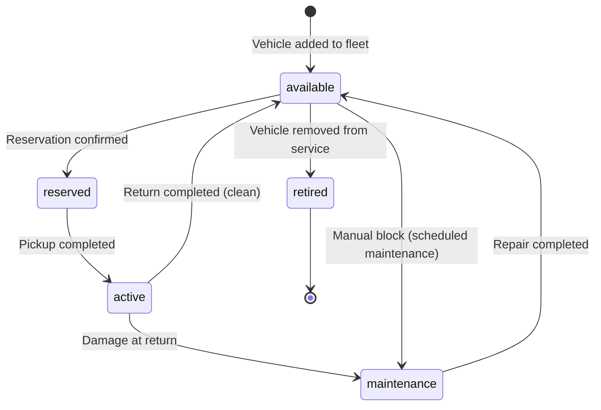

**States:**
- `available` — Can be booked
- `reserved` — Has a confirmed future reservation
- `active` — Currently on rental
- `maintenance` — Unavailable — in repair or servicing
- `retired` — Permanently removed — kept for historical data

**Business rule:** A vehicle in `active` state cannot be booked for an overlapping period. A vehicle in `maintenance` can have future reservations if the maintenance end date does not overlap.

---

### 7.2 Customer Lifecycle

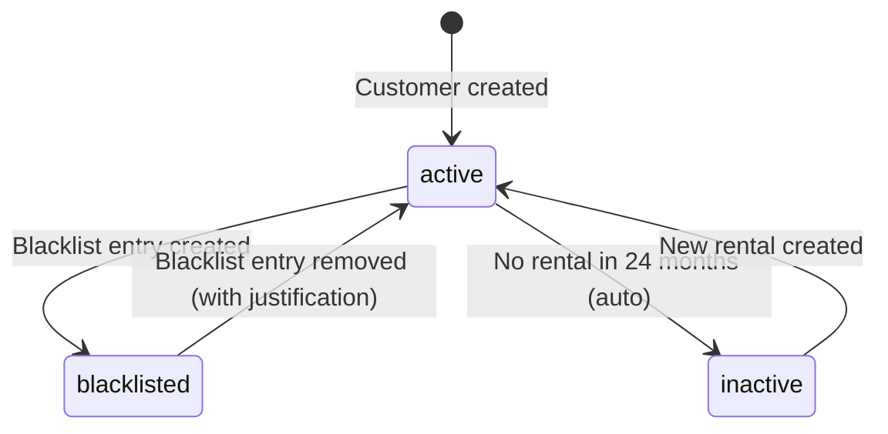

**Business rule:** Blacklisting does not prevent reservation creation — it shows a warning that the agent must acknowledge. This allows edge cases (e.g. a blacklisted client whose debt was settled) without requiring a permission escalation to proceed.

**Gap identified:** There is no "merge duplicate customer" workflow. When the same person is registered twice (different spelling), there is no way to merge their reservation history. This should be planned as a Phase 2 utility.

---

### 7.3 Reservation Lifecycle

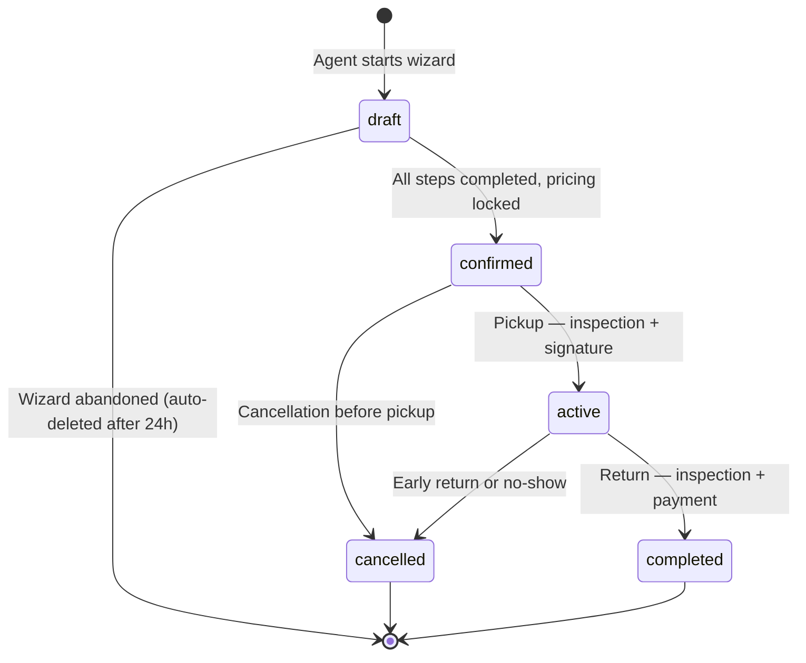

**Transitions:**
| From | To | Required |
|------|----|----------|
| `draft` | `confirmed` | Valid client, available vehicle, pricing snapshot locked, date range |
| `confirmed` | `active` | Completed inspection, client signature, starting mileage |
| `active` | `completed` | Return inspection, end mileage, at least one payment |
| `confirmed` | `cancelled` | Cancellation reason — refund policy applied |
| `active` | `cancelled` | Override reason — deposit handling decided |

---

### 7.4 Contract Lifecycle

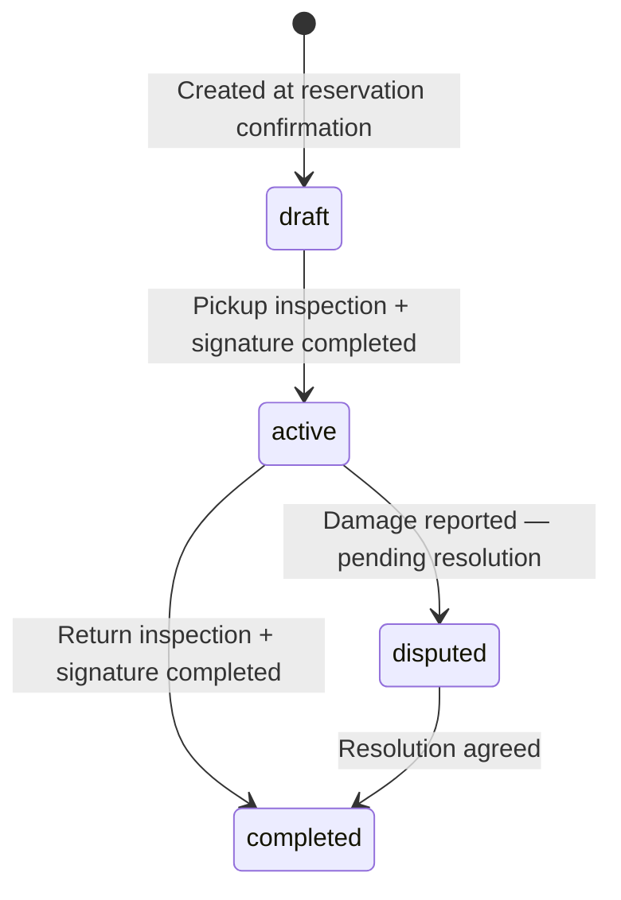

**Important:** The contract record is created at reservation confirmation (not at pickup). It holds `template_version_id` and `template_snapshot` from the moment of creation so the correct template version is always available, even if the template is edited before pickup.

---

### 7.5 Invoice Lifecycle

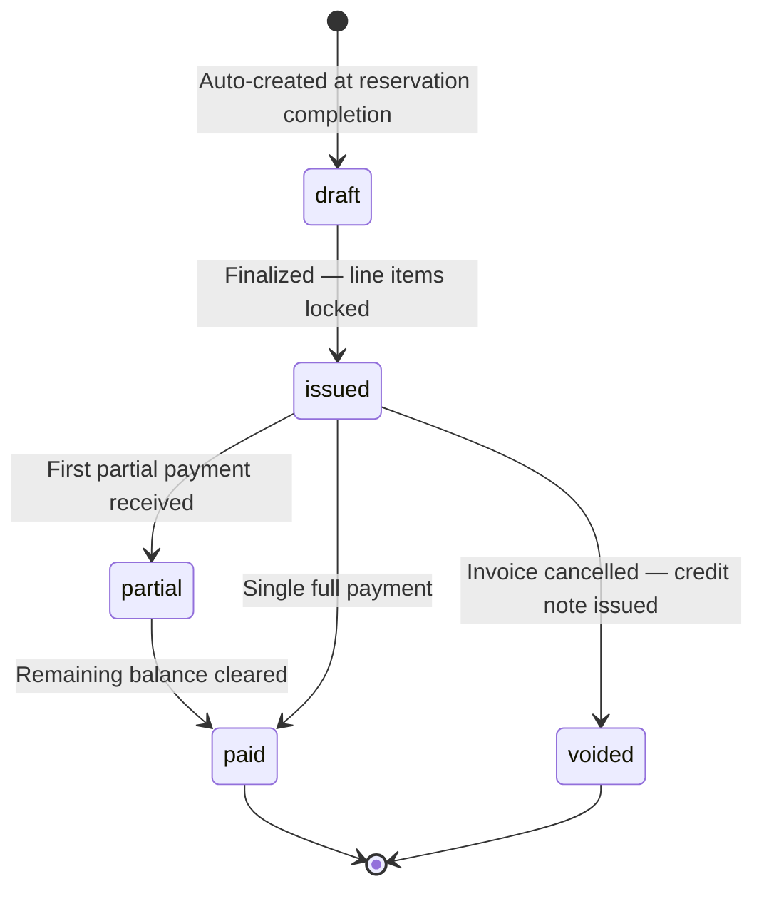

**Business rule:** An invoice in `issued` or `partial` state cannot have its line items changed. If the amount is disputed, the invoice is voided and a new one is issued with corrected items. Voiding creates an audit trail entry.

---

### 7.6 Payment Lifecycle

```mermaid
stateDiagram-v2
  [*] --> recorded: Agent records payment
  recorded --> confirmed: Payment method verified (cash = instant)
  confirmed --> refunded: Refund issued
  confirmed --> [*]
  refunded --> [*]
```

---

### 7.7 Deposit Lifecycle

```mermaid
stateDiagram-v2
  [*] --> held: Collected at pickup
  held --> released: Returned to client at return (clean)
  held --> retained: Kept — damage, late return, or unpaid balance
  held --> partially_released: Partial release — partial damage
  partially_released --> retained: Remainder retained
  partially_released --> [*]
  released --> [*]
  retained --> [*]
```

**Business rule:** A retained deposit requires a justification note and creates an audit log entry. The retained amount is recorded as income in the finance module.

---

## 8. Business Rules

### Fleet Rules

| Rule | Enforcement |
|------|------------|
| A vehicle cannot be booked if a confirmed/active reservation overlaps the requested dates | DB-level check on reservation creation |
| A vehicle in `retired` status cannot be added to a new reservation | Server Action validation |
| Vehicle registration, insurance, and inspection documents must have expiry dates | Required fields — nullable only for vignette |
| Mileage at return must be ≥ mileage at pickup | Server Action validation |
| Fuel level is on a 1–8 scale (empty to full) | Enum validation |
| A vehicle can only belong to one agency at a time | `agency_id NOT NULL` on `vehicles` |

### Reservation Rules

| Rule | Enforcement |
|------|------------|
| Minimum rental duration: 1 day | Server Action: `end_date > start_date` |
| Pricing snapshot is locked at confirmation and cannot be changed | `locked_at TIMESTAMPTZ NOT NULL` — write-once pattern |
| A client on the blacklist triggers a warning, not a hard block | UI warning — agent confirms to proceed |
| Reservations in `confirmed` status can be edited up to 24h before pickup | Business rule in Service layer |
| Cancellation within 24h of pickup forfeits the deposit (if configured) | Configurable via agency settings |
| A vehicle cannot be double-booked | Overlap check: `start_date < existing.end_date AND end_date > existing.start_date` |
| Draft reservations not confirmed within 24h are auto-deleted | Background job |

### Finance Rules

| Rule | Enforcement |
|------|------------|
| Invoice amounts are derived from pricing snapshot only | No free-text amounts — line items auto-generated |
| Deposits are tracked separately from invoice payments | Separate `deposits` table — not linked to `invoice_id` |
| A payment amount cannot exceed the invoice outstanding balance | Server Action validation |
| Retained deposits must have a justification reason | `reason TEXT NOT NULL` on deposit retain action |
| Tax rate is configured per agency (default 20%) | Read from `agency_settings.tax_rate` |
| Amounts are stored in integer cents — never float | `BIGINT` column, display layer divides by 100 |

### Client Rules

| Rule | Enforcement |
|------|------------|
| Driving license expiry must be checked before reservation confirmation | Soft warning if expired — not a hard block |
| A client under 21 may have a surcharge (young driver fee) | Configurable in agency pricing settings |
| A client cannot be deleted if they have reservations | `ON DELETE RESTRICT` on `customer_id` FK |
| Duplicate detection on phone number and license number | Unique constraint — duplicate shown as warning, not blocked |

### Membership Rules

| Rule | Enforcement |
|------|------------|
| A user can only belong to one company | Unique on `company_memberships.user_id` |
| An invitation token expires after 7 days | `expires_at` enforced on accept |
| An invitation can only be accepted once | `status = 'accepted'` set on first use |
| The OWNER role cannot be removed from the company | Server Action guard: `role = OWNER` blocks deletion |
| A company must always have at least one OWNER | Delete membership check |

### Subscription Rules

| Rule | Enforcement |
|------|------------|
| Adding a vehicle checks the plan vehicle limit | `plan_limits WHERE key = 'max_vehicles'` |
| Adding an agency checks the plan agency limit | `plan_limits WHERE key = 'max_agencies'` |
| Inviting a user checks the plan user limit | `plan_limits WHERE key = 'max_users'` |
| Limit `-1` means unlimited | Convention enforced in `can-use-feature.ts` helper |
| Feature access is gated by plan feature flags | `plan_features WHERE key = 'feature_name'` |

---

## 9. Automation Flows

### 9.1 Pricing Snapshot Creation

Triggered when reservation status changes from `draft` to `confirmed`.

```
1. Read current pricing settings for agency + vehicle category
2. Read reservation details (dates, vehicle, extras selected)
3. Calculate:
   - days = ceil((end_date - start_date) / 86400)
   - base_amount = days × daily_rate (from pricing settings)
   - discount_amount = base_amount × (discount_percent / 100)
   - extras_amount = SUM of all selected extra prices
   - deposit_amount = vehicle.deposit_override ?? category.deposit_amount
   - tax_amount = (base_amount - discount_amount + extras_amount) × tax_rate
   - total = base_amount - discount_amount + extras_amount + tax_amount
4. Write ONE row to reservation_pricing_snapshots
5. Set snapshot.locked_at = now()
6. No further writes to this row are permitted
```

**Why this matters:** Pricing settings change. A customer who booked at 350 MAD/day must not be invoiced at 400 MAD/day because rates changed between booking and return. The snapshot is the legal record.

---

### 9.2 Timeline Event Creation

Every state change in reservations, contracts, payments, and documents must append a row to `reservation_timeline_events`. This is not optional — it is the audit trail for the reservation.

```
Triggers that create timeline events:
- reservation.status changed         → type: status_changed
- contract created                   → type: contract_created
- contract signed (pickup)           → type: picked_up
- contract signed (return)           → type: returned
- payment recorded                   → type: payment_recorded
- invoice issued                     → type: invoice_issued
- deposit collected                  → type: deposit_collected
- deposit released                   → type: deposit_released
- deposit retained                   → type: deposit_retained
- note added manually by agent       → type: note_added
- damage reported                    → type: damage_reported
```

Each event stores: `type`, `label` (human-readable), `actor_id`, `actor_name`, `metadata` (JSON — specific to event type), `created_at`.

---

### 9.3 Alert Generation

Alerts are not stored independently — they are derived on-demand from document expiry dates and reservation states. Exception: custom manual alerts.

```
Sources of alerts:
- vehicle_insurances WHERE expires_at <= now() + 30 days AND status = 'active'
- vehicle_registrations WHERE expires_at <= now() + 30 days
- vehicle_inspections WHERE expires_at <= now() + 30 days
- vehicle_vignettes WHERE expires_at <= now() + 30 days
- customer_documents WHERE expires_at <= now() + 14 days AND doc_type = 'driving_license'
- reservations WHERE status = 'active' AND end_date < now()  (overdue returns)
- reservations WHERE status = 'confirmed' AND start_date <= now()  (missed pickup)
```

Alert priority is computed from days remaining:
- `urgent` — ≤ 0 days (expired or overdue)
- `proche` — 1–7 days
- `info` — 8–30 days

**Gap identified:** Alert data is currently queried at page load. For scale, a daily background job should write alert rows to a persistent `alerts` table that the UI queries. This decouples alert generation from page render time and allows notification delivery.

---

### 9.4 Audit Log Creation

Every `INSERT`, `UPDATE`, and `DELETE` on business tables must write an audit log entry. This is implemented at the Service layer (not database trigger) so it captures actor context.

```
audit_logs row contains:
- entity_type    (e.g. 'reservation')
- entity_id      (UUID of the changed record)
- action         (created | updated | deleted)
- actor_id       (user who performed the action)
- agency_id      (scope)
- changes        (JSONB: { field: { from, to } } — for updates)
- ip_address     (from request context)
- created_at
```

Audit logs are **append-only**. No update or delete is ever performed on this table. Retention policy: minimum 7 years (regulatory requirement for financial records).

---

### 9.5 Activity Log Creation

Human-readable feed for the Workspace activity view. Created alongside audit logs but with different content.

```
activity_logs row contains:
- actor_id, actor_name, actor_avatar     (denormalized — join-free rendering)
- agency_id, agency_name                 (denormalized)
- verb                ('created a reservation', 'updated vehicle', ...)
- entity_type, entity_id, entity_label  (for navigation links)
- metadata            (JSONB — flexible per verb)
- created_at
```

Activity logs are retained for 90 days. They are not compliance records — they are a UX feature.

---

### 9.6 Invoice Auto-Generation

```
Trigger: reservation.status → completed

1. Assert pricing_snapshot exists and is locked
2. Create invoice (status: draft, agency_id, company_id, reservation_id, customer_id)
3. For each snapshot field, create invoice_line_item:
   - "Location de base" — snapshot.base_amount
   - "Remise" — -snapshot.discount_amount (if > 0)
   - Each selected extra from reservation_extras
4. If damage report exists: add damage line items
5. Apply tax: snapshot.tax_rate from snapshot
6. Set invoice.subtotal, invoice.tax_amount, invoice.total
7. If advance payment exists: set invoice.amount_paid from payments
8. invoice.status → issued
9. Enqueue PDF generation job
10. Insert reservation_timeline_event (type: invoice_issued)
```

---

## 10. Background Jobs

All jobs are implemented as Vercel Cron functions in `app/api/cron/`.

| Job | Schedule | Action | Failure behavior |
|-----|----------|--------|-----------------|
| `expire-drafts` | Every hour | Delete reservation drafts older than 24h | Log and skip — retry next hour |
| `generate-alerts` | Daily at 6:00 UTC | Write computed alerts to `alerts` table (Phase 2) | Log — stale alerts remain |
| `generate-pdfs` | Every 5 minutes | Process queued invoice and contract PDF jobs | Retry up to 3 times — mark failed |
| `check-document-expiry` | Daily at 7:00 UTC | Check vehicle docs and customer docs — create alert records | Log — non-blocking |
| `send-return-reminders` | Daily at 8:00 UTC | Email clients whose rental ends today (Phase 2) | Log — skip if email disabled |
| `snapshot-dashboard-kpis` | Daily at 2:00 UTC | Write pre-aggregated KPIs to `dashboard_snapshots` (Phase 3) | Log — dashboard falls back to live query |
| `expire-invitations` | Daily at 3:00 UTC | Mark invitations past `expires_at` as `expired` | Log — idempotent |
| `archive-audit-logs` | Monthly | Move audit logs older than 1 year to cold storage | Manual review if fails |

### Job Safety Requirements

- Every cron handler must be **idempotent** — running it twice must produce the same result
- Every cron handler must log start, completion, and any errors to a `cron_logs` table
- Cron handlers must verify the `CRON_SECRET` header before executing (Vercel Cron sends this automatically)
- No cron job should run longer than 10 seconds — split long jobs into paginated chunks

---

## 11. Future Extension Points

Every extension described here plugs into the existing schema through **UUID references only**. No existing table requires modification.

### 11.1 Stripe Payments

**New tables:** `billing_accounts`, `stripe_customers`, `stripe_subscriptions`, `stripe_invoices`, `payment_intents`

**Existing hook:** `companies.plan_id → plans` already exists. Stripe replaces the manual billing workflow without touching `reservations`, `payments`, or `invoices`.

**Plug-in point:** `payments.external_reference TEXT NULL` is already reserved for external payment IDs.

### 11.2 Booking.com / Channel Manager

**New tables:** `channel_integrations`, `channel_listings`, `channel_sync_jobs`, `channel_sync_logs`

**Existing hook:** `reservation_sources` lookup table already has a `channel` type. A Booking.com reservation maps to `source = 'booking_com'` with `channel_reservation_id` stored in `reservations.external_id TEXT NULL`.

**Logic:** A sync job polls the channel API, maps the response to the LokaRent reservation schema, creates a reservation with `source_id → booking_com`, and marks it `status: confirmed` automatically.

### 11.3 Public API

**New tables:** `api_keys`, `api_key_scopes`, `api_usage_logs`, `rate_limit_buckets`

**Existing hook:** All business entities have stable UUIDs. The API layer is a thin read/write proxy over the existing Service layer — no schema changes.

**Security requirement:** API keys are stored as `sha256(key)` — the raw key is shown once at creation and never stored.

### 11.4 Webhooks

**New tables:** `webhook_endpoints`, `webhook_subscriptions`, `webhook_deliveries`, `webhook_delivery_attempts`

**Existing hook:** Every module's Service layer already dispatches domain events to an in-process event bus. Webhook delivery subscribes to that bus and sends HTTP POST to the configured endpoint.

**Retry semantics:** Exponential backoff — 1s, 5s, 30s, 5m, 30m. After 5 failures the endpoint is marked `status: failing`. Owner is notified.

### 11.5 Email Notifications

**New tables:** `notification_templates`, `notification_logs`, `notification_preferences`

**Existing hook:** The timeline event system already records every business event. A notification service subscribes to those events and dispatches emails through Resend.

**Phase 2 notifications:** Reservation confirmation, contract signed, invoice issued, payment received, return reminder (day before), document expiry warning.

### 11.6 Customer Portal

**New tables:** `portal_access_tokens`, `portal_sessions`, `portal_customer_views`

**Existing hook:** `customers.email` already exists. A portal token is emailed to the customer; they access a read-only view of their reservations and invoices. No new business logic — existing data, new presentation layer.

### 11.7 Accounting Export

**New tables:** `accounting_integrations`, `accounting_sync_jobs`, `accounting_journal_entries`

**Existing hook:** `invoices`, `payments`, and `expenses` already have all the fields needed for double-entry bookkeeping. The accounting integration maps these to debit/credit journal entries in the target system (QuickBooks, Sage, etc.).

### 11.8 White Label

**New tables:** `white_label_configs`, `white_label_domains`, `white_label_themes`

**Existing hook:** `companies.id` is the tenant key. A white label config per company sets custom domain, logo, colors, and removes LokaRent branding. The Next.js middleware routes the custom domain to the correct tenant context.

### 11.9 Mobile App

**No new tables required.** The mobile app consumes the Public API (11.3). The existing Server Actions are refactored into API routes during that phase. All data is already structured for mobile consumption.

### 11.10 CRM

**New tables:** `crm_contacts`, `crm_notes`, `crm_tasks`, `crm_pipelines`, `crm_deals`

**Existing hook:** `customers` becomes a CRM contact. Reservations become deals. The CRM layer adds prospecting and follow-up workflows that do not exist in Phase 1.

---

## 12. Folder Architecture

```
/
├── app/
│   ├── (public)/                      # No auth required
│   │   ├── page.tsx                   # Landing page
│   │   ├── pricing/page.tsx
│   │   ├── login/page.tsx
│   │   ├── register/page.tsx
│   │   ├── forgot-password/page.tsx
│   │   └── invite/[token]/page.tsx    # Invitation acceptance
│   │
│   ├── onboarding/page.tsx            # Post-register, pre-dashboard
│   │
│   ├── (app)/                         # Agency-scoped — auth required
│   │   ├── layout.tsx                 # AgencyProvider, auth guard
│   │   ├── dashboard/page.tsx
│   │   ├── reservations/
│   │   │   ├── page.tsx
│   │   │   ├── new/page.tsx
│   │   │   └── [id]/edit/page.tsx
│   │   ├── cars/page.tsx
│   │   ├── clients/page.tsx
│   │   ├── contracts/page.tsx
│   │   ├── calendar/page.tsx
│   │   ├── finances/
│   │   │   ├── page.tsx
│   │   │   └── expenses/page.tsx
│   │   ├── reports/page.tsx
│   │   ├── alerts/page.tsx
│   │   └── settings/
│   │       ├── layout.tsx
│   │       ├── page.tsx               # Redirect to agency/
│   │       ├── agency/page.tsx
│   │       ├── users/page.tsx
│   │       ├── teams/page.tsx
│   │       ├── pricing/page.tsx
│   │       ├── contract-template/page.tsx
│   │       ├── business-rules/page.tsx
│   │       └── notifications/page.tsx
│   │
│   ├── workspace/                     # Company-scoped — OWNER only
│   │   ├── layout.tsx
│   │   ├── page.tsx
│   │   ├── members/page.tsx
│   │   ├── agencies/page.tsx
│   │   ├── teams/page.tsx
│   │   ├── permissions/page.tsx
│   │   ├── billing/page.tsx
│   │   ├── activity/page.tsx
│   │   └── invitations/page.tsx
│   │
│   └── api/
│       ├── auth/[...better-auth]/route.ts
│       └── cron/
│           ├── expire-drafts/route.ts
│           ├── generate-alerts/route.ts
│           ├── generate-pdfs/route.ts
│           └── expire-invitations/route.ts
│
├── modules/                           # Business feature modules
│   ├── auth/
│   │   ├── actions/
│   │   ├── services/
│   │   ├── repositories/
│   │   ├── validators/
│   │   ├── dto/
│   │   └── types/
│   ├── reservations/
│   ├── cars/
│   ├── clients/
│   ├── contracts/
│   ├── finances/
│   ├── reports/
│   ├── calendar/
│   ├── alerts/
│   └── workspace/
│       ├── agencies/
│       ├── members/
│       ├── permissions/
│       ├── billing/
│       ├── activity/
│       └── invitations/
│
├── shared/                            # Cross-cutting concerns
│   ├── auth/
│   │   ├── better-auth.config.ts
│   │   ├── get-session.ts
│   │   └── require-auth.ts
│   ├── permissions/
│   │   ├── can.ts                     # can(userId, agencyId, key) → boolean
│   │   ├── rbac.ts
│   │   └── permission-keys.ts        # Enum of all permission keys
│   ├── database/
│   │   └── client.ts                 # Drizzle singleton
│   ├── errors/
│   │   ├── app-error.ts
│   │   ├── not-found.error.ts
│   │   ���── unauthorized.error.ts
│   │   ├── forbidden.error.ts
│   │   └── validation.error.ts
│   ├── events/
│   │   ├── event-bus.ts
│   │   └── event.types.ts
│   ├── notifications/
│   ├── responses/
│   │   ├── api-response.ts
│   │   └── paginated-response.ts
│   ├── storage/
│   │   └── storage.service.ts        # Vercel Blob wrapper
│   └── utils/
│       ├── date.ts
│       ├── currency.ts               # Integer cents formatting
│       ├── pagination.ts
│       └── slug.ts
│
├── packages/
│   ├── db/
│   │   ├── schema/                   # Drizzle schema files — one per domain
│   │   │   ├── multi-tenant.ts
│   │   │   ├── identity.ts
│   │   │   ├── subscription.ts
│   │   │   ├── fleet.ts
│   │   │   ├── customers.ts
│   │   │   ├── reservations.ts
│   │   │   ├── contracts.ts
│   │   │   ├── finance.ts
│   │   │   ├── documents.ts
│   │   │   └── audit.ts
│   │   ├── migrations/
│   │   ├── seed.ts
│   │   └── index.ts
│   ├── types/                        # Shared TypeScript types
│   ├── validations/                  # Shared Zod schemas
│   ├── ui/                           # Shared UI components
│   └── config/                       # App configuration
│
├── components/                       # UI components (existing structure)
├── contexts/                         # React contexts
├── lib/                              # Mock data (to be replaced)
│
├── middleware.ts                     # Auth guard + agency routing
├── next.config.mjs
├── drizzle.config.ts
└── package.json
```

### Module Internal Structure

Every module follows the same internal structure:

```
modules/[feature]/
├── actions/          # Server Actions — called from UI
├── services/         # Business logic — called by actions
├── repositories/     # Data access — DB queries only
├── validators/       # Zod schemas for input validation
├── dto/              # Input and output types
├── mappers/          # DB model → DTO mapping
├── permissions/      # Permission key constants for this module
├── types/            # TypeScript interfaces
└── index.ts          # Public barrel export
```

**Dependency rule:** `actions → services → repositories → DB`. No layer skips a layer. UI components never import from `repositories` directly.

---

## 13. Development Roadmap

This is the exact order in which the system must be built. Each phase produces a working, deployable artifact. No phase leaves the system in a broken state.

### Phase 0 — Infrastructure (Week 1)

1. Set up Neon database (PostgreSQL)
2. Configure Drizzle ORM + drizzle-kit
3. Write Drizzle schema for all 55 Phase 1 tables
4. Run initial migration
5. Write seed script — one test company, one agency, five users, ten vehicles, twenty reservations
6. Configure Better Auth (email + password only)
7. Configure Vercel Blob
8. Set up environment variables
9. Verify: login with seeded user, session persists, agency context loads

**Deliverable:** Database is live, auth works, seed data loads.

---

### Phase 1 — Auth & Onboarding (Week 2)

1. Register endpoint — create company + agency + user in one transaction
2. Login — session, redirect to dashboard
3. Onboarding wizard — three steps (settings, fleet, pricing)
4. Company status lifecycle: `onboarding → active`
5. Auth middleware — protect all `/app/*` and `/workspace/*` routes
6. Agency context — load active agency, switch agency
7. Role-based access — `can()` helper implemented and tested

**Deliverable:** New user can register, complete onboarding, and land on a live dashboard.

---

### Phase 2 — Fleet Module (Week 3)

1. Vehicle CRUD — add, edit, delete, soft-delete
2. Vehicle history sub-tables — insurance, registration, inspection, vignette, maintenance
3. Mileage log — create on add vehicle, update on reservation events
4. Vehicle availability — conflict check query
5. Vehicle documents — Vercel Blob upload for PDFs and photos
6. Vehicle categories — lookup table, seeded from defaults, per-company

**Deliverable:** Agent can add a vehicle with all documents and see its complete history.

---

### Phase 3 — Client Module (Week 3–4)

1. Customer CRUD — individual and business
2. Customer documents — driving license, passport, with expiry dates
3. Blacklist — create entry, remove entry, warning display
4. Client search — by name, phone, license number
5. Duplicate detection — warn on matching phone or license

**Deliverable:** Agent can create and manage clients with document tracking.

---

### Phase 4 — Reservation Module (Weeks 4–5)

1. Reservation creation wizard — five steps (client, vehicle, dates, pricing, summary)
2. Availability check — reject overlapping bookings
3. Pricing snapshot — compute and lock at confirmation
4. Reservation timeline — append events on every transition
5. Kanban board — drag-to-change-status
6. List view — sortable, filterable
7. Reservation detail panel — all tabs (details, payment, contract, timeline)
8. Calendar view — vehicle grid with reservation blocks
9. Edit reservation — allowed fields only, audit logged

**Deliverable:** Full reservation lifecycle from creation to confirmation.

---

### Phase 5 — Contract Module (Week 5–6)

1. Contract template editor — header, clauses, footer, language settings
2. Template versioning — every save creates a new version
3. Contract creation at pickup — template snapshot stored
4. Vehicle inspection checklist — pickup event
5. Mileage and fuel level recording
6. Client signature capture
7. Return inspection — return event
8. Contract PDF generation — background job
9. PDF storage in Vercel Blob

**Deliverable:** Agent can complete a full pickup → return with signed contract and PDF.

---

### Phase 6 — Finance Module (Week 6–7)

1. Invoice auto-generation at reservation completion
2. Invoice line items from pricing snapshot
3. Payment recording — multiple payments per invoice
4. Deposit management — collect, release, retain
5. Expense management — add, categorize, link to vehicle/reservation
6. Invoice PDF generation
7. Finance dashboard — summary cards, revenue charts

**Deliverable:** Complete financial flow from invoice creation to payment recording.

---

### Phase 7 — Reports Module (Week 7)

1. Revenue report — by period, by vehicle, by client
2. Occupancy rate — fleet utilization over time
3. Top vehicles and top clients
4. Expense breakdown by category
5. Compliance report — documents expiring or expired
6. CSV/Excel export for all reports

**Deliverable:** Owner and accountant can generate and export all key reports.

---

### Phase 8 — Alerts Module (Week 8)

1. Alerts query — aggregate from all sources (vehicle docs, customer docs, overdue reservations)
2. Alert priority computation
3. Alert detail panel
4. Alert actions — mark resolved, dismiss
5. Alert KPIs on dashboard banner

**Deliverable:** Proactive alert system surfaces compliance and operational risks.

---

### Phase 9 — Workspace Module (Week 8–9)

1. Members management — list, invite, remove, change role
2. Agencies management — list, add, edit, deactivate
3. Teams — create, assign members
4. Permissions matrix — custom role editor
5. Activity log — all company events
6. Invitations management — list pending, resend, cancel
7. Billing view — current plan, usage, limits (UI only in Phase 1 — no Stripe yet)

**Deliverable:** Owner can manage their full company configuration.

---

### Phase 10 ��� Settings Module (Week 9)

1. Agency profile — name, logo, address, phone, currency
2. Pricing rules — base rates per category, seasonal pricing, extras pricing
3. Business rules — late fee, deposit policy, young driver surcharge
4. Notification preferences (Phase 2 — UI exists, backend wired later)
5. Plan usage display — vehicles used vs limit

**Deliverable:** Agency is fully configurable without code changes.

---

### Phase 11 — Hardening (Week 10)

1. Permission enforcement audit — every Server Action checked
2. Input validation — every action has a Zod validator
3. Error boundaries — every page handles loading and error states
4. Audit log completeness — every mutation writes an audit entry
5. Performance — add indexes for all hot queries
6. Rate limiting on auth endpoints
7. End-to-end tests for the full reservation lifecycle
8. Background job implementation and testing

**Deliverable:** Production-ready. Passes security and reliability review.

---

## 14. Cross-Module Interactions

```mermaid
graph TD
  Auth --> |session| All[All Modules]
  Reservations --> |vehicle availability check| Fleet
  Reservations --> |client blacklist check| Clients
  Reservations --> |creates| Contracts
  Reservations --> |triggers| Finance
  Contracts --> |mileage event| Fleet
  Contracts --> |updates status| Reservations
  Finance --> |uses snapshot from| Reservations
  Finance --> |expense linked to| Fleet
  Alerts --> |reads docs from| Fleet
  Alerts --> |reads license from| Clients
  Alerts --> |reads overdue from| Reservations
  Dashboard --> |aggregates| Reservations
  Dashboard --> |aggregates| Finance
  Dashboard --> |aggregates| Fleet
  Dashboard --> |reads| Alerts
  Calendar --> |reads| Reservations
  Calendar --> |reads availability blocks from| Fleet
  Reports --> |reads all| Reservations
  Reports --> |reads all| Finance
  Reports --> |reads all| Fleet
  Reports --> |reads all| Clients
  Settings --> |pricing rules used by| Reservations
  Settings --> |contract template used by| Contracts
  Workspace --> |membership changes affect| All
```

### Interaction Details

| Source Module | Target Module | Interaction | Direction |
|--------------|---------------|-------------|-----------|
| Reservations | Fleet | Check vehicle availability before confirmation | Sync read |
| Reservations | Clients | Check blacklist status before confirmation | Sync read |
| Reservations | Finance | Trigger invoice creation on completion | Async event |
| Contracts | Fleet | Write mileage log on pickup and return | Sync write |
| Contracts | Reservations | Update reservation status on signature | Sync write |
| Finance | Reservations | Read pricing snapshot for invoice generation | Sync read |
| Finance | Fleet | Link expenses to vehicles | Sync write |
| Alerts | Fleet | Read document expiry dates | Sync read |
| Alerts | Clients | Read license expiry dates | Sync read |
| Alerts | Reservations | Read overdue and missed pickups | Sync read |
| Settings/Pricing | Reservations | Supply rates to pricing snapshot calculation | Sync read |
| Settings/Contract | Contracts | Supply template version for snapshot | Sync read |
| Workspace/Members | All | Modify user permissions — invalidate permission cache | Async event |

---

## 15. Edge Cases and Failure Scenarios

### Reservation Workflow

| Scenario | Expected behavior |
|----------|------------------|
| Agent starts reservation wizard but abandons it | Draft expires after 24h via cron job |
| Two agents create reservations for the same vehicle at the same time | DB-level uniqueness check on overlap — second one fails with conflict error |
| Vehicle breaks down during an active rental | Agent marks vehicle as `maintenance`, creates availability block. Existing active reservation remains active (historical). New bookings blocked. |
| Client's driving license expires mid-rental | Alert generated. No automatic action — agent decides. |
| Agent edits reservation dates after pricing snapshot is locked | Date change requires pricing snapshot recalculation. New snapshot created. Old snapshot archived (not deleted). |
| Reservation confirmed but vehicle added to maintenance before pickup | System blocks pickup. Agent must reassign vehicle or cancel reservation. |
| Client disputes reservation dates after return | Timeline events provide audit trail. Contract inspection records are immutable. |

### Finance Workflow

| Scenario | Expected behavior |
|----------|------------------|
| Invoice generated with wrong amount | Invoice voided. New invoice created. Audit log records both actions. |
| Payment amount exceeds invoice total | Server Action rejects — error shown to agent |
| Deposit collected but client does not pay invoice | Deposit can be applied to invoice balance as a retained deposit. Manual decision by admin. |
| Refund requested after payment | Refund recorded as negative payment. Invoice status updated. If invoice was paid, status → partial. |
| Agency tax rate changes after invoices are issued | Existing invoices are unaffected — tax rate is stored on pricing snapshot, not read from settings at invoice time. |
| Invoice PDF generation fails | Job retries up to 3 times. Invoice is still valid — PDF is a convenience. Agent notified on third failure. |

### Fleet Workflow

| Scenario | Expected behavior |
|----------|------------------|
| Vehicle document expires while it has active reservations | Alert generated. No automatic action — business decision required. |
| Attempt to delete a vehicle with reservation history | `ON DELETE RESTRICT` on vehicle FK. Error shown. Agent must retire vehicle instead. |
| Two vehicles have the same plate number | Unique constraint on `(agency_id, plate)`. Error shown on second creation. |
| Mileage at return is less than mileage at pickup | Server Action validation rejects. Agent must correct. |
| Vehicle registration renewal creates a new document | New row in `vehicle_registrations` with new `expires_at`. Old row is not deleted — historical record. |

### Membership & Auth Workflow

| Scenario | Expected behavior |
|----------|------------------|
| Invited user's email already belongs to another company | Invitation creation is rejected. Error: "This email is already registered with another company." |
| Owner tries to remove their own account | Server Action guard prevents removing the last OWNER role. |
| Invitation token expired | User sees "Invitation expired" page. Admin must resend. Token is marked `expired`. |
| User is removed from an agency mid-session | Next Server Action call fails permission check. Session is not invalidated, but all mutations are blocked. |
| User switches agency in the UI | `AgencyProvider` updates `activeAgencyId`. All subsequent queries use new `agency_id`. |

### Onboarding Workflow

| Scenario | Expected behavior |
|----------|------------------|
| Browser closes during onboarding step 2 | Company record exists with `status: onboarding`. On next login, redirect to onboarding and resume from last completed step. |
| Onboarding wizard completes but email confirmation fails | Company is still created. Email confirmation is non-blocking. Owner can log in without it (Phase 1). |
| Two registration requests with the same email | First one succeeds. Second one: duplicate check on `users.email` fails. Error: "Account already exists." |

### Background Job Failures

| Job | Failure scenario | Recovery |
|-----|-----------------|----------|
| `expire-drafts` | DB connection drops mid-run | No data loss — drafts remain as drafts. Next run at next hour cleans them up. |
| `generate-pdfs` | PDF service unavailable | Retry 3 times with exponential backoff. Invoice remains valid without PDF. Alert written to `cron_logs`. |
| `check-document-expiry` | Runs but alert table write fails | Alerts for that day are missing. Next day's run regenerates them. Non-critical. |
| `expire-invitations` | Partial run (some invitations processed, then crash) | Idempotent — skips already-expired invitations. Next run completes remaining. |

### Data Integrity Gaps to Address Before Phase 1

1. **Draft reservation cleanup**: If the background job never runs (Vercel Cron misconfigured), draft reservations accumulate. Add a `created_at < now() - interval '24 hours'` check to reservation creation to block new drafts from vehicles with stale conflicting drafts.

2. **Pricing snapshot missing**: If the reservation is confirmed but the snapshot write fails (race condition or DB error), the reservation proceeds without a locked price. The confirmation Server Action must wrap both writes in a single transaction. If the snapshot fails, the reservation rolls back to `draft`.

3. **Contract template deleted after contracts exist**: `contract_templates.deleted_at` must use soft delete. Contracts hold `template_version_id` — that version must remain readable forever. Hard delete of template versions is forbidden.

4. **Agency settings not seeded at company creation**: If the agency settings seed fails, the first reservation cannot compute a tax rate. The seed must be part of the registration transaction.

5. **Concurrent mileage logs**: If two agents both submit return mileage at the same moment (edge case in shared agency), both logs are written. A unique constraint on `(reservation_id, event_type)` prevents duplicate pickup/return logs.

---

*Blueprint version: 1.0 — July 2026*
*Cross-references: DATABASE_PHASE1.md, DATABASE_FINAL_REVIEW.md, DATABASE_ARCHITECTURE.md*
